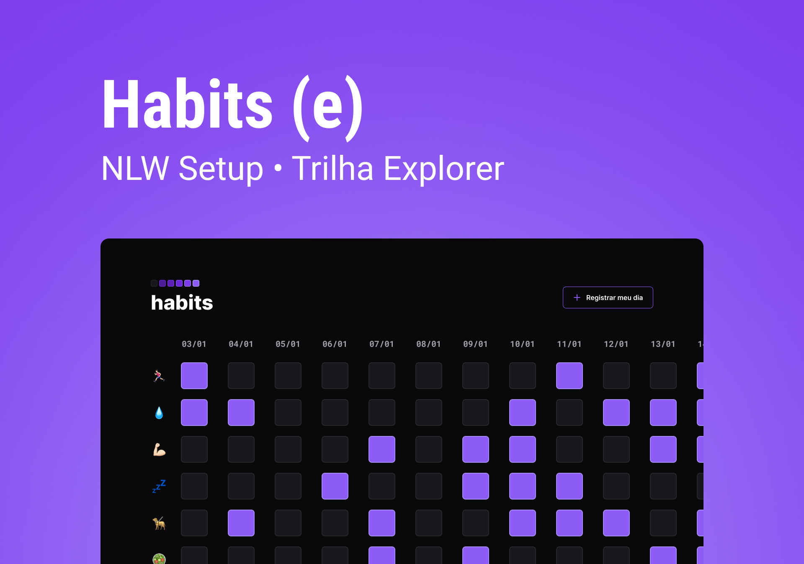

<h1 align="center"> Habits </h1>

NLW is an exclusive and free event, promoted by Rocketseat for teaching WEB technologies.  

  <a href="#-tecnhologies">Technologies</a>&nbsp;&nbsp;&nbsp;|&nbsp;&nbsp;&nbsp;
  <a href="#-project">Project</a>&nbsp;&nbsp;&nbsp;|&nbsp;&nbsp;&nbsp;
  <a href="#-layout">Layout</a>&nbsp;&nbsp;&nbsp;|&nbsp;&nbsp;&nbsp;
  <a href="#memo-license">License</a>

  

 

  

## 🚀 Technologies

This project was developed with the following technologies:

- HTML & CSS
- JavaScript
- Git & Github
- Figma

## 💻 Project

Habits is an app used to track habits.

- [Visit the project online](https://alcantaravca.github.io/nlw-setup/)

## 🔖 Layout

You can view the project layout through [THIS LINK](https://www.figma.com/community/file/1187422022288947321). It is necessary to have a [Figma](https://figma.com) account to access it.
 .  Figma 
## :memo: License

This project is licensed under the MIT license.

---

Made with ♥ by Victor Alcantara :wave:
